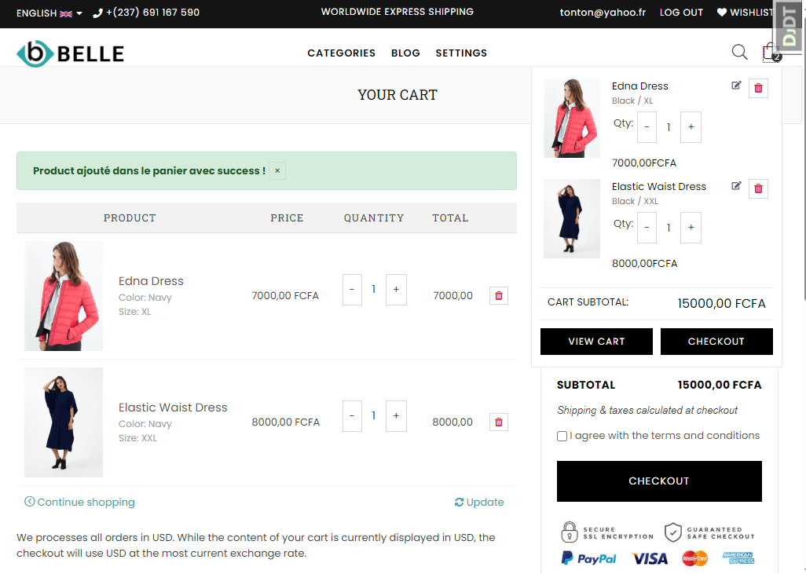
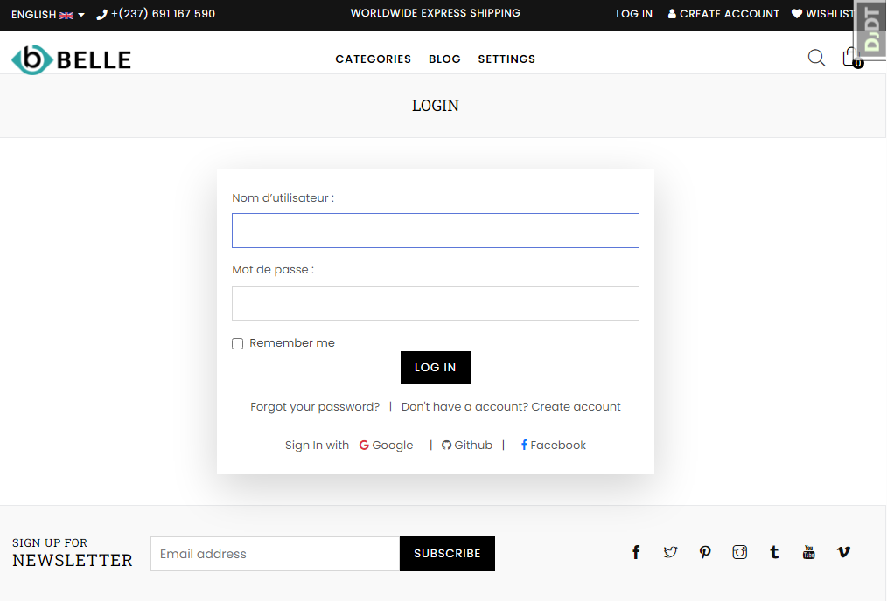

## 🔗 LOGO 

<h2 align="center"> E-commerce | TatfoSuperMarket </h2>

<p align="center">
 
</p>

# Django E-commerce TatfoSuperMarket
This is Online Electronic shopping store. Responsive Online Shopping Store Using Django, HTML, CSS, JavaScript, Bootstrap framework etc

# Used in Projets
`HTML` `CSS` `JavaScript` `Bootstrap` `Ajax` `Jquery` `Django` `Python` `FontAwesome` `Owl Carosul`

## Features Included
- Custom Admin dashboard
- Search Functionality
- Shopping Cart
- Order Management
- Coupon system
- Payments Using NOTCHPAY 
- Much more...

### Prerequisites

To run this project in production or development mode you have to make sure, [Python](https://www.python.org/downloads/) is installed on your computer. If you opted to install an older version of Python, it is possible that it did not come with `Pip` preinstalled.

- To check Python and Pip are installed on your machine:

```bash
# Python
python --version

# Pip
pip --version

## Installation

```bash
pip install virtualenv

```bash
# Mac OS or Linux
source venv/bin/activate

```
**1.clone Repository & Install Packages**

```sh
git clone https://github.com/Tchatchoua14/TatfoSuperMarket.git
pip install -r requirements.txt
```
**2.Setup Virtualenv**
```sh
virtualenv env
source env/bin/activate
```
**3.Migrate & Start Server**
```sh
python manage.py makemigrations
python manage.py migrate
python manage.py runserver
```

# Command

$ `django-admin` --> Show details use in Django

$ `pip freeze` --> Show install  packages on Django.

$ `django-admin startproject <project_name> ` --> Create Project in Django.

$ `cd <project_name>` --> Change Directory and go to project folder.

$ `python3 manage.py runserver ` --> Start Django project port:8000 `http://127.0.0.1:8080`

$ `python3 manage.py runserver <port_no>` --> If you want to change your project server port's  then Run this commsnds.
##### For Example:

# Create Superuser in Django
$ `python manage.py createsuperuser` --> This command id Created Django Admin User.

Username: <input type="text" placeholder="Username"/>

Email address: <input type="email" placeholder="Username"/>

Password: <input type="password" placeholder="Username"/>

Password(again): <input type="password" placeholder="Username"/>

# Requirments install
$ `pip install -r <file_name> `

$ `pip install django`

$ `pip install django-pillow`

$ `pip install django-rest-framework`

$ `pip install django-allauth`

$ `pip install django-recaptcha`

##### Built with
Technologies such as **Python** (v3.12) and **Django** in the 
backend, **SQLite3** in the database architecture and 
**JavaScript**, **Bootstrap4**, **JQuery**, **AJAX**, **HTML5** 
and **CSS3** in the frontend were used in the development of the 
project.
- [Python](https://www.python.org/) - Python is an interpreted 
high-level general-purpose programming language.
- [Django](https://www.djangoproject.com/) - Django is a 
Python-based free and open-source web framework that follows the
 model–template–views architectural pattern.
- [SQLite](https://www.sqlite.org/index.html) - SQLite is a 
relational database management system contained in a C library.
- [JavaScript](https://www.javascript.com/) - JavaScript, often abbreviated as JS, is a programming language that conforms to the
 ECMAScript specification.
- [Bootstrap](https://getbootstrap.com/) - Bootstrap is a free 
and open-source CSS framework directed at responsive, mobile-first front-end web development.

##### ProjectScreenShot 

## Home


## Product Cart


## Login


## Payment NotchPay

